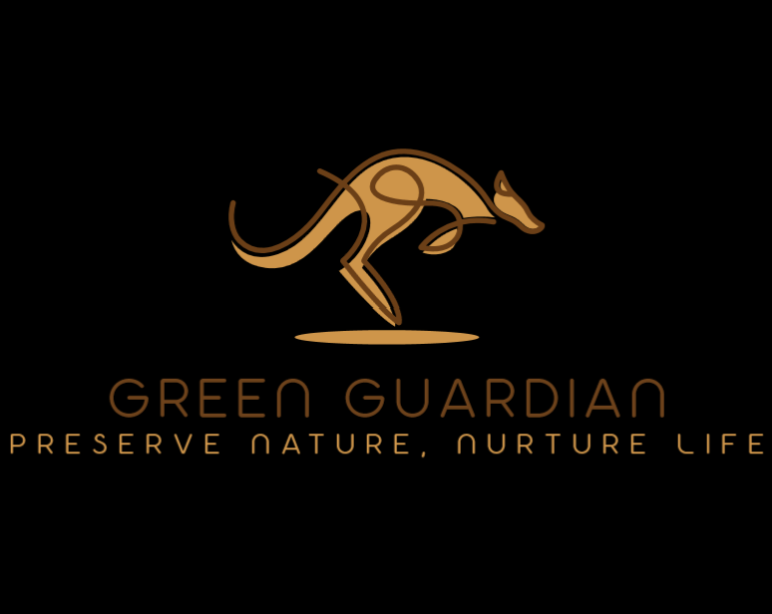

# 🤖 Green Guardian App



**Green Guardian App** is a powerful Streamlit-based application designed to simplify document management. Upload your PDF documents, create embeddings for efficient retrieval, and interact with your documents through an intelligent chatbot interface. 🚀

## 🛠️ Features

- **📂 Document Addition**: Easily add documents to the knowledge Base of Green Guardeen app.
- **🧠 Create Embeddings**: Generate embeddings for your documents to enable efficient search and retrieval.
- **🤖 Chatbot Interaction**: Interact with your documents using a smart chatbot that leverages the created embeddings.
- **🌟 User-Friendly Interface**: Enjoy a sleek and intuitive UI with emojis and responsive design for enhanced user experience.

## 🖥️ Tech Stack

The Green Guardian App employs a suite of advanced technologies to ensure a smooth and efficient user experience. Here's an overview of the technologies and tools utilized:
  
- **[Unstructured](https://github.com/Unstructured-IO/unstructured)**: Used for comprehensive PDF processing, allowing for the extraction and preprocessing of text from uploaded PDF documents.
  
- **[BGE Embeddings from HuggingFace](https://huggingface.co/BAAI/bge-small-en)**: Used to generate high-quality embeddings for the processed documents, facilitating effective semantic search and retrieval.
  
- **[Qdrant](https://qdrant.tech/)**: A vector database running locally via Docker, responsible for storing and managing the generated embeddings for fast and scalable retrieval.
  
- **[LLaMA 3.2 via Ollama](https://ollama.com/)**: Integrated as the local language model to power the chatbot, providing intelligent and context-aware responses based on the document embeddings.

- **[Streamlit](https://streamlit.io/)**: The core framework for building the interactive web application, offering an intuitive interface for users to upload documents, create embeddings, and interact with the chatbot.

## 🚀 Getting Started

Follow these instructions to set up and run the Green Guardian App on your local machine.

### 1. Clone the Repository

```bash
git clone https://github.com/anotherwebguy/Green-Guardian-App.git
cd Green-Guardian-App

2. Create a Virtual Environment

On Windows:

python -m venv venv
venv\Scripts\activate

On macOS and Linux:

python3 -m venv venv
source venv/bin/activate

3. Install Dependencies

Once the environment is set up, install the required dependencies using requirements.txt:

pip install -r requirements.txt

4. Run the qdrant vector db container in the docker within the same folder

docker pull qdrant/qdrant

docker run -p 6333:6333 -p 6334:6334 \
    -v "$(pwd)/qdrant_storage:/qdrant/storage:z" \
    qdrant/qdrant

5. Run the App

Start the Streamlit app using the following command:

streamlit run app.py

This command will launch the app in your default web browser. If it doesn’t open automatically, navigate to the URL provided in the terminal (usually http://localhost:8501).
```

### 🤝 Contributing

Contributions are welcome! Whether it’s reporting a bug, suggesting a feature, or submitting a pull request, your input is highly appreciated. Follow these steps to contribute:

1.	Fork the Repository: Click on the “Fork” button at the top-right corner of the repository page.
2.	Clone Your Fork
3.	Create a New Branch:

```
git checkout -b feature/YourFeatureName
```


4.	Make Your Changes: Implement your feature or fix.
5.	Commit Your Changes:

```
git commit -m "Add Your Feature Description"
```


6.	Push to Your Fork:

```
git push origin feature/YourFeatureName
```


7.	Create a Pull Request: Navigate to the original repository and create a pull request from your fork.

